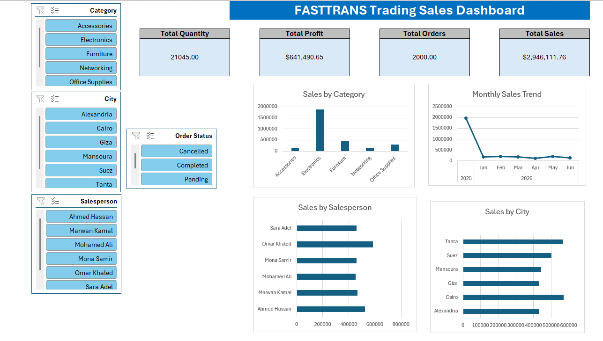

# 📊 FASTTRANS Trading Sales Dashboard

## 📊 Overview

An interactive Sales Dashboard built in Microsoft Excel for analyzing company sales performance.

## 🔧 Tools Used

- Microsoft Excel
- Power Query
- Pivot Tables
- Pivot Charts
- Slicers
- KPI Cards

## 📁 Files

- FASTTRANS-Sales-Dashboard.xlsx
- FASTTRANS-Sales-Dashboard.pdf
- Dashboard.png
- 
## 📈 Dashboard Features

- Total Sales
- Total Profit
- Total Orders
- Total Quantity

### Interactive Filters

- Category
- City
- Salesperson
- Order Status

### Charts

- Sales by Category
- Monthly Sales Trend
- Sales by Salesperson
- Sales by City

## 🎯 Skills Demonstrated

- Data Cleaning with Power Query
- Data Modeling
- Dashboard Design
- KPI Reporting
- Interactive Reporting

## 👤 Author

Marwan Mahmoud
